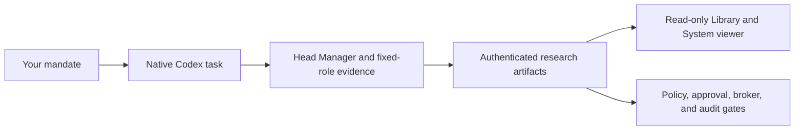

# TradingCodex

<div align="center">
  <a href="https://pypi.org/project/tradingcodex/"></a>
  <a href="LICENSE"></a>
  
  
</div>

### Research in Codex, with a trail you can inspect.

TradingCodex is a local-first investment operating system for Codex. Ask a
question in natural language, let a bounded fixed-role team gather and challenge
evidence, then keep the resulting research, source posture, uncertainty, and
next steps in your own workspace.

It is not an autonomous trading bot. A research response never becomes a
broker action on its own.

[Get started](https://monarchjuno.github.io/tradingcodex/) · [All user-facing skills](docs/user-facing-skills.md) · [Provider to order](https://monarchjuno.github.io/tradingcodex/provider-to-order.html) · [Documentation](docs/README.md)

## Start Here

1. **Attach an empty workspace.** TradingCodex creates the local contract,
   launcher, skills, hooks, and research folders without creating a commit or
   remote.
2. **Open a new native Codex task.** Start with the outcome you need, not with
   a preselected analyst or agent.
3. **Inspect the evidence.** Read saved artifacts in the read-only workspace
   viewer, then continue, narrow the question, or stop.

You need Git, `uvx`, and an installed, authenticated `codex` CLI. In the empty
folder where you want research to live, run:

```bash
cd /path/to/your/empty-workspace
uvx --refresh --from tradingcodex tcx attach . && ./tcx doctor
./tcx service ensure
```

On native Windows PowerShell:

```powershell
cd C:\path\to\your\empty-workspace
uvx --refresh --from tradingcodex tcx attach .
.\tcx.cmd doctor
.\tcx.cmd service ensure
```

Then fully restart Codex, open and trust that workspace, and start a new task.
The local viewer is available at `http://127.0.0.1:48267/`. End users do not
need Node, npm, or a separate frontend server.

> [!IMPORTANT]
> To set up a user workspace, use `tcx attach` in the target folder. Do not
> clone this source repository into that workspace.

## Choose Your Path

| What you want to do | Start with | What happens next |
| --- | --- | --- |
| Investigate a company, thesis, event, portfolio fit, or risk question | [`$tcx-workflow`](https://monarchjuno.github.io/tradingcodex/research.html) | Head Manager chooses the smallest useful fixed-role team and returns evidence-backed artifacts or a clear waiting, revise, or blocked state. |
| Make an ambiguous request concrete | [`$tcx-plan`](https://monarchjuno.github.io/tradingcodex/skill-plan.html) | Clarify scope, allowed actions, and stop conditions; use the resulting mandate in a new workflow task. |
| Review a past decision or validate a lesson | [`$tcx-memory`](https://monarchjuno.github.io/tradingcodex/skill-memory.html) | Replay from point-in-time evidence and distinguish decision quality from outcome quality. |
| Create a reusable method or reasoning framework | [`$tcx-strategy`](https://monarchjuno.github.io/tradingcodex/skill-strategy.html) or [`$tcx-brain`](https://monarchjuno.github.io/tradingcodex/skill-brain.html) | Start directly with the matching skill in the normal Research profile; its current-turn scope cannot grant execution authority or cross into generic Build work. |
| Monitor work on a schedule | [`$tcx-automate`](https://monarchjuno.github.io/tradingcodex/skill-automate.html) | Create or update a Codex Scheduled Task that invokes the actual work skill on each run. |
| Open the dashboard or recover a workspace | [`$tcx-dashboard`](https://monarchjuno.github.io/tradingcodex/skill-dashboard.html) or [`$tcx-server`](https://monarchjuno.github.io/tradingcodex/skill-server.html) | Open the read-only viewer inside Codex by default, request an external browser when needed, or receive a readiness check and safe recovery handoff. |
| Connect a provider and prepare an order | [Provider to order](https://monarchjuno.github.io/tradingcodex/provider-to-order.html) | Keep provider setup, account sync, ticket creation, checks, approval, and final action as separate checkpoints. |

There are 13 user-facing skills. Browse their detailed behavior, examples, and
boundaries in the [User Guide](https://monarchjuno.github.io/tradingcodex/skills.html).

## Run Your First Research Task

In a new native Codex task, use the workflow skill and state both your desired
outcome and the boundaries that must remain in force:

```text
$tcx-workflow
Analyze MSFT as a medium-term quality compounder. Separate facts, inferences,
and assumptions. Include contrary evidence and invalidation conditions. No order.
```

The workflow begins a lightweight, workspace-bound run. Head Manager selects
only the fixed-role specialists the question needs, reassesses from accepted
artifacts, and either synthesizes the result or states why work is waiting,
needs revision, or is blocked.

## How TradingCodex Is Organized

| Layer | What it does | What it does not do |
| --- | --- | --- |
| **Native Codex task** | Interprets the request, runs Head Manager, and dynamically dispatches exact fixed-role specialists. | It does not turn ordinary prose into an order or use a generic agent to imitate a specialist. |
| **Workspace** | Holds readable research, reports, source snapshots, skills, prompts, and lightweight run provenance. | It is not the portfolio, order, account, approval, or secret ledger. |
| **Django service** | Enforces artifact identity, policy, approval, broker, idempotency, execution, and audit rules through shared application services. | It does not replace Codex with a semantic router, preset team, or stored workflow DAG. |
| **Read-only viewer** | Lets you browse Library artifacts, Skills, System posture, and registered workspaces. | It does not launch Codex, write workspace files, or mutate orders, brokers, skills, or policy. |



## What You Keep

TradingCodex keeps the work inspectable after the chat ends:

- Research handoffs and evidence under `trading/research/`.
- Role reports under `trading/reports/`.
- Source snapshots, point-in-time posture, forecasts, and decision-memory
  artifacts that explain what was known and when.
- A read-only viewer with **Library**, **Skills**, and **System** sections for
  the attached workspace.

The workspace is yours to read, back up, diff, and version. The service keeps
execution-sensitive runtime state in its central local ledger instead of hiding
that state in prompts or workspace files.

## Safety by Design

- Research, planning, memory, and automation do not imply broker authority.
- Provider connection, ticket drafting, checks, risk approval, and final order
  action are deliberately separate steps. The built-in provider is Paper; live
  adapters remain blocked until every documented gate is satisfied.
- Fixed roles have bounded tools and handoff responsibilities. A final order
  path is available only from an exact root-native protocol, never from the
  viewer, a subagent, public REST, generic CLI, or direct MCP call.
- Raw credentials do not belong in prompts, workspace files, reports, API/MCP
  output, or audit data.

TradingCodex provides research workflow and execution guardrails. It is not
financial, investment, legal, tax, or regulatory advice, and it does not
guarantee returns.

## Learn More

| Read this | When you need |
| --- | --- |
| [User Guide](https://monarchjuno.github.io/tradingcodex/) | Setup, examples, concepts, all user-facing skills, and provider-to-order onboarding. |
| [Installation](installation.md) | Install variants, updates, runtime homes, MCP/service startup, and recovery. |
| [User-facing skills](docs/user-facing-skills.md) | The full skill map, entry rules, and hard stops. |
| [Research memory and artifacts](docs/research-memory-and-artifacts.md) | Artifact paths, source posture, versions, quality labels, forecasts, and exports. |
| [Decision memory](docs/decision-memory.md) | Replay, postmortems, lesson validation, and reusable context. |
| [Safety policy and execution](docs/safety-policy-and-execution.md) | Permissions, approvals, brokers, secrets, and execution boundaries. |
| [Documentation index](docs/README.md) | The complete product and maintainer documentation map. |

## Developing TradingCodex

This repository is product source, not a user workspace. Start with
[CONTRIBUTING.md](CONTRIBUTING.md), then follow the validation route for your
change in [docs/validation-and-test-plan.md](docs/validation-and-test-plan.md).

## License

TradingCodex is an Apache-2.0 open-core project. See [LICENSE](LICENSE),
[NOTICE](NOTICE), and [TRADEMARKS.md](TRADEMARKS.md).
