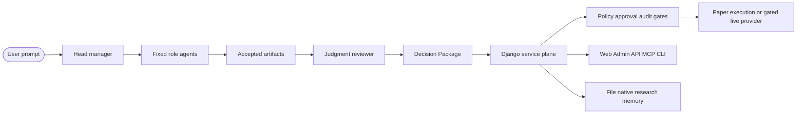

> [!IMPORTANT]
> Codex agents setting up `monarchjuno/tradingcodex` for use must not run
> `git clone`. In the empty target workspace, run the packaged CLI:
> `uvx --refresh --from tradingcodex tcx attach . && ./tcx doctor`.
> Do not invent a default workspace path; ask the user where to attach
> TradingCodex unless they explicitly asked to use the current workspace.
> Clone this repository only when the user explicitly asks to develop,
> inspect, or modify TradingCodex source code.

# TradingCodex

<div align="center">
  <a href="https://github.com/monarchjuno/tradingcodex/actions/workflows/ci.yml"></a>
  <a href="https://github.com/monarchjuno/tradingcodex/releases"></a>
  <a href="https://pypi.org/project/tradingcodex/"></a>
  <a href="LICENSE"></a>
  
  
</div>

<div align="center">
  <a href="https://github.com/monarchjuno/tradingcodex/stargazers"></a>
  <a href="https://github.com/monarchjuno/tradingcodex/network/members"></a>
  <a href="https://github.com/monarchjuno/tradingcodex/issues"></a>
</div>

### Codex-native investment work needs an agentic harness, not a chat transcript.

TradingCodex is an agentic investment workflow harness for Codex-native
research, thesis review, portfolio/risk handoffs, and service-gated execution
checks. Codex coordinates the work, specialist agents own bounded judgments,
and TradingCodex keeps execution behind explicit service gates.

[User-Facing Skills](#user-facing-skills) | [Quick Start](#installation) | [Architecture](#architecture) | [Docs](docs/README.md) | [Safety](docs/safety-policy-and-execution.md) | [Contributing](CONTRIBUTING.md) | [License](LICENSE)

<p align="center">
  
</p>

---

## About

TradingCodex gives Codex a durable operating system for agentic investment
workflows: fixed specialist roles, independent judgment review, source-aware
handoffs, thesis lifecycle memory, policy and approval services, and a local
review dashboard.

It is not an autonomous trading bot. Natural-language answers do not become
broker actions. The core ships paper execution by default; live broker support
comes only from installed, reviewed providers and explicit live gates.

---

## User-Facing Skills

TradingCodex is easiest to use by choosing the right user-facing skill:

| Primary skill | Use when | Stops before |
| --- | --- | --- |
| `tcx-workflow` | Investment research, thesis review, Decision Packages, portfolio fit, risk review, or order-readiness workflow planning. | Substantive synthesis before accepted role artifacts; approval or execution without service gates. |
| `strategy-creator` | Turning user rules into reusable strategy skills, updating strategy criteria, activating, archiving, or inspecting strategy state. | Live ticker analysis, recommendation, order approval, execution, or policy changes. |
| `tcx-server` | Checking dashboard/service health, doctor output, update status, MCP readiness, DB path, or startup recovery. | Investment judgment, broker execution, raw secrets, or template edits. |
| `tcx-build` | Build-mode connector/provider work, broker/API scaffolding, capability profile wiring, credential-ref setup, and validation. | Raw secret handling, live order submission, or investment subagent dispatch. |

| Supporting skill | Use when | Main output |
| --- | --- | --- |
| `plan-workflow` | You want an explicit workflow plan before role dispatch or implementation. | Bounded plan with selected stages, roles, gates, and waiting/revise/blocked posture. |
| `automate-workflow` | You want to define a repeatable workflow automation without executing trades. | Automation recipe, trigger scope, guardrails, and review requirements. |
| `postmortem` | A workflow, decision, artifact, or execution/process step needs review after the fact. | Failure analysis, missed assumptions, source-quality lessons, and future warning patterns. |

Most investment prompts enter through natural language, then the hook writes
compact intake and `head-manager` uses `tcx-workflow` to draft, validate, and
record the staged plan before dispatch. See
[User-facing skills](docs/user-facing-skills.md) for the detailed routing map.

---

## Installation

Run this from the empty workspace where you want Codex agents to work:

```bash
uvx --refresh --from tradingcodex tcx attach . && ./tcx doctor
```

Then fully quit and restart Codex, open the generated workspace, and start a
new thread so project MCP config, prompts, skills, and hooks are loaded.

When TradingCodex MCP autostarts the local service, open:

```text
http://127.0.0.1:48267/
```

See [installation.md](installation.md) for persistent CLI install, GitHub-main
install, source-development setup, update flows, installer-script equivalents,
MCP/service details, and smoke checks.

---

## Workflow

TradingCodex is designed around handoffs:

```text
evidence -> analysis -> valuation -> portfolio fit -> risk review
  -> draft order -> approval receipt -> approved service-gated submission
  -> connection result -> audit/postmortem
```

The `head-manager` maps the request, dispatches the selected role team, waits
for accepted artifacts, preserves conflicts, and synthesizes only what the
workflow has earned. Weak, stale, missing, or out-of-scope upstream work returns
`revise`, `blocked`, or `waiting` instead of being patched over by another role.

---

## Role Roster

| Layer | Agent | Owns |
| --- | --- | --- |
| Main agent | `head-manager` | Intake, workflow dispatch, coordination, artifact acceptance, synthesis, and validation/audit status. |
| Research | `fundamental-analyst` | Business quality, financial statements, filings, economics, and fundamental risks. |
| Research | `technical-analyst` | Price action, trends, momentum, volume, volatility, and liquidity setup. |
| Research | `news-analyst` | Verified news, disclosures, event chronology, catalysts, and narrative change. |
| Market context | `macro-analyst` | Macro, rates, FX, commodities, liquidity, policy, and cross-asset transmission. |
| Market context | `instrument-analyst` | ETF/index, options, crypto public market structure, credit-signal boundary, and instrument mechanics. |
| Decision review | `valuation-analyst` | Valuation ranges, scenario assumptions, multiples, sensitivity, and decision-quality gaps. |
| Decision review | `judgment-reviewer` | Independent challenge review of accepted artifacts for contrary evidence, source trust, overconfidence, update triggers, and invalidation conditions. |
| Portfolio | `portfolio-manager` | Portfolio fit, sizing, concentration, liquidity, opportunity cost, and draft order-ticket readiness. |
| Risk | `risk-manager` | Downside, restricted-list checks, policy readiness, approval readiness, and approval receipts. |
| Execution | `execution-operator` | Approved submission/cancel/status through the TradingCodex service boundary only; live requires all gates. |

---

## Key Features

| Feature | What it gives you |
| --- | --- |
| Agentic workflow planning | Natural-language prompts become staged plans, selected role teams, accepted artifacts, and explicit `waiting`, `revise`, or `blocked` states. |
| Independent judgment review | `judgment-reviewer` challenges accepted artifacts for contrary evidence, source trust, overconfidence, update triggers, and invalidation conditions. |
| Decision Packages | Investment theses keep forecastable claims, lifecycle assumptions, contrary evidence, owner roles, follow-up, and postmortem requirements. |
| Strategy skills | `strategy-creator` turns user rules into reusable strategy skills without granting order approval, execution, broker, or policy authority. |
| File-native research memory | Research markdown, role reports, source snapshots, readiness labels, versions, and handoff metadata remain ordinary workspace files. |
| Service-gated execution | Order tickets, approvals, policy checks, idempotency, broker connections, account sync, and audit stay behind Django service-layer gates. |
| Local review surfaces | Web, Admin, API, MCP, CLI, and generated hooks share the same service plane for review, status, research, Broker Center, orders, and portfolio state. |

---

## Architecture



The architecture is intentionally small: Codex owns coordination and role
handoffs; Django owns durable policy, order, approval, portfolio, integration,
research, and audit behavior. The core package uses Django templates, local
static HTMX, and small plain JavaScript. There is no Node, bundler, React, or
frontend build step.

---

## Safety Boundary

TradingCodex blocks or constrains:

- direct live broker requests
- raw broker API calls and raw external source execution proxies
- self-issued approvals
- restricted-symbol orders
- expired or payload-mismatched approval receipts
- duplicate approved-order submissions
- raw secrets in workspace files, prompts, API responses, MCP responses, audit
  payloads, generated docs, or shell output
- unsupported live execution through any provider, instrument, account, or
  policy posture that has not passed the explicit live gate

TradingCodex is research, workflow, and execution-guardrail tooling. It is not
financial, investment, legal, tax, or regulatory advice, and it does not
provide investment recommendations or guarantee returns.

---

## Roadmap

| Status | Milestone |
| --- | --- |
| Shipped | Generated Codex workspace, fixed role roster, project MCP config, Django service plane, local web dashboard, Admin, Ninja API, file-native research memory, component registry, policy/audit primitives. |
| Current `0.3.5` | Safe TradingCodex MCP tools auto-approved for subagents, execution tools hidden outside `execution-operator`, Build Center customization, Codex MCP discovery/import, external MCP permission approval UX, head-manager research synthesis depth, flexible package/workspace update status, skipped-version Django migration smoke coverage, Codex-native Decision Packages, independent judgment-review gate, staged workflow planning, artifact-supervisor loop closure state, Evidence Run/Validation Cards, provider capability profiles, and Python `>=3.11,<3.15` support. |
| Next | Deeper validation scenarios, richer provider capability profiles, stronger generated-workspace smoke coverage, and improved artifact quality tooling. |
| Future | Separately governed verified adapters, hosted/managed services, enterprise policy/compliance packs, and broker-specific live providers only after explicit product, policy, adapter, and validation work. |

---

## Documentation

`README.md` is the product overview. The `docs/` directory is the human-readable
source of truth for detailed product behavior, safety, architecture, workflow,
validation, and release policy.

| Start here | Use for |
| --- | --- |
| [Installation](installation.md) | Setup, update, GitHub-main install, MCP/service startup, and smoke checks. |
| [Docs index](docs/README.md) | Human-readable reading paths, document ownership, and change-to-doc routing. |
| [User-facing skills](docs/user-facing-skills.md) | Which primary or supporting skill fits each user workflow and what each must not do. |
| [Core concepts and rules](docs/core-concepts-and-rules.md) | Fast operating reference for planes, guardrails, roles, execution lifecycle, and research memory. |
| [Product direction](docs/product-direction.md) | Product thesis, target user posture, goals, non-goals, runtime defaults, and scope. |
| [Workspace orchestration model](docs/harness.md) | Top-level workflow model, components, guardrails, improvement, and naming rules. |
| [Roles, skills, and workflows](docs/roles-skills-and-workflows.md) | Fixed role roster, no-overlap handoffs, dispatch gates, skills, and strategy behavior. |
| [Safety policy and execution](docs/safety-policy-and-execution.md) | Permissions, approvals, idempotency, broker safety, secret wall, and required blocks. |
| [System architecture](docs/system-architecture.md) | Runtime planes, Django app boundaries, central DB ownership, models, and service use cases. |
| [Interfaces and surfaces](docs/interfaces-and-surfaces.md) | Product web, Admin, API, MCP, CLI, and generated wrapper behavior. |
| [Validation plan](docs/validation-and-test-plan.md) | Required tests, generated workspace smokes, MCP smokes, and routing scenarios. |

---

## Contributing

Contributions use Apache-2.0 with DCO sign-off. See
[CONTRIBUTING.md](CONTRIBUTING.md).

For source changes, start with the focused validation command for the touched
area, then broaden as needed:

```bash
python -m pytest
python manage.py check
python -m compileall tradingcodex_cli tradingcodex_service apps tests
```

Harness, agent, workflow, MCP, policy, skill, hook, or template changes also
need generated-workspace validation. See
[docs/validation-and-test-plan.md](docs/validation-and-test-plan.md).

---

## License

TradingCodex is an Apache-2.0 open-core project.

Source code, generated workspace templates, and project documentation are
licensed under the Apache License, Version 2.0 unless marked otherwise. The
TradingCodex name, future logos, and official product marks are not granted by
the code license. See [LICENSE](LICENSE), [NOTICE](NOTICE), and
[TRADEMARKS.md](TRADEMARKS.md).

## Star History

<a href="https://www.star-history.com/?repos=monarchjuno%2Ftradingcodex&type=date&legend=top-left">
 <picture>
   <source media="(prefers-color-scheme: dark)" srcset="https://api.star-history.com/chart?repos=monarchjuno/tradingcodex&type=date&theme=dark&legend=top-left" />
   <source media="(prefers-color-scheme: light)" srcset="https://api.star-history.com/chart?repos=monarchjuno/tradingcodex&type=date&legend=top-left" />
   
 </picture>
</a>
